# Luồng nghiệp vụ — feature credits

> Chỉ vẽ bước có trong code; bước suy đoán ghi 🔵/🟡. Nguồn: F-id truy về `credits-reverse-spec.md` Mục 9; cite rút gọn theo `_evidence.md`.

## F1 — Xem ví + dọn rác lười (UC-01)

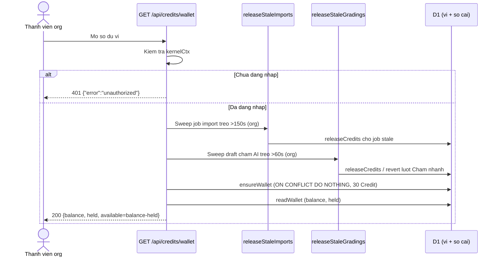
```mermaid
sequenceDiagram
    actor U as Thanh vien org
    participant API as GET /api/credits/wallet
    participant SI as releaseStaleImports
    participant SG as releaseStaleGradings
    participant DB as D1 (vi + so cai)
    U->>API: Mo so du vi
    API->>API: Kiem tra kernelCtx
    alt Chua dang nhap
        API-->>U: 401 {"error":"unauthorized"}
    else Da dang nhap
        API->>SI: Sweep job import treo >150s (org)
        SI->>DB: releaseCredits cho job stale
        API->>SG: Sweep draft cham AI treo >60s (org)
        SG->>DB: releaseCredits / revert luot Cham nhanh
        API->>DB: ensureWallet (ON CONFLICT DO NOTHING, 30 Credit)
        API->>DB: readWallet (balance, held)
        API-->>U: 200 {balance, held, available=balance-held}
    end
```

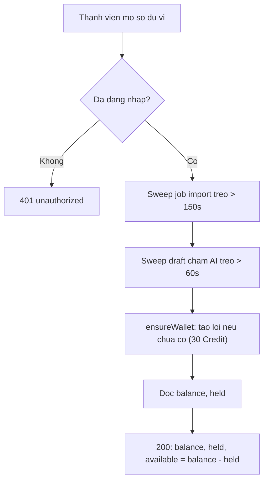
```mermaid
flowchart TD
    A["Thanh vien mo so du vi"] --> B{"Da dang nhap?"}
    B -->|"Khong"| C["401 unauthorized"]
    B -->|"Co"| D["Sweep job import treo > 150s"]
    D --> E["Sweep draft cham AI treo > 60s"]
    E --> F["ensureWallet: tao loi neu chua co (30 Credit)"]
    F --> G["Doc balance, held"]
    G --> H["200: balance, held, available = balance - held"]
```

## F2 — Nhập đề AI thành công (UC-02)

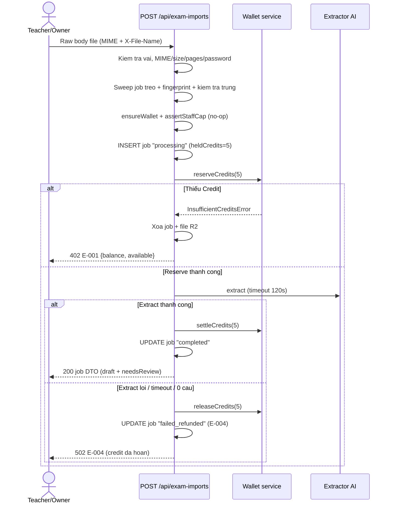
```mermaid
sequenceDiagram
    actor T as Teacher/Owner
    participant API as POST /api/exam-imports
    participant W as Wallet service
    participant AI as Extractor AI
    T->>API: Raw body file (MIME + X-File-Name)
    API->>API: Kiem tra vai, MIME/size/pages/password
    API->>API: Sweep job treo + fingerprint + kiem tra trung
    API->>API: ensureWallet + assertStaffCap (no-op)
    API->>API: INSERT job "processing" (heldCredits=5)
    API->>W: reserveCredits(5)
    alt Thiếu Credit
        W-->>API: InsufficientCreditsError
        API->>API: Xoa job + file R2
        API-->>T: 402 E-001 {balance, available}
    else Reserve thanh cong
        API->>AI: extract (timeout 120s)
        alt Extract thanh cong
            API->>W: settleCredits(5)
            API->>API: UPDATE job "completed"
            API-->>T: 200 job DTO (draft + needsReview)
        else Extract loi / timeout / 0 cau
            API->>W: releaseCredits(5)
            API->>API: UPDATE job "failed_refunded" (E-004)
            API-->>T: 502 E-004 (credit da hoan)
        end
    end
```

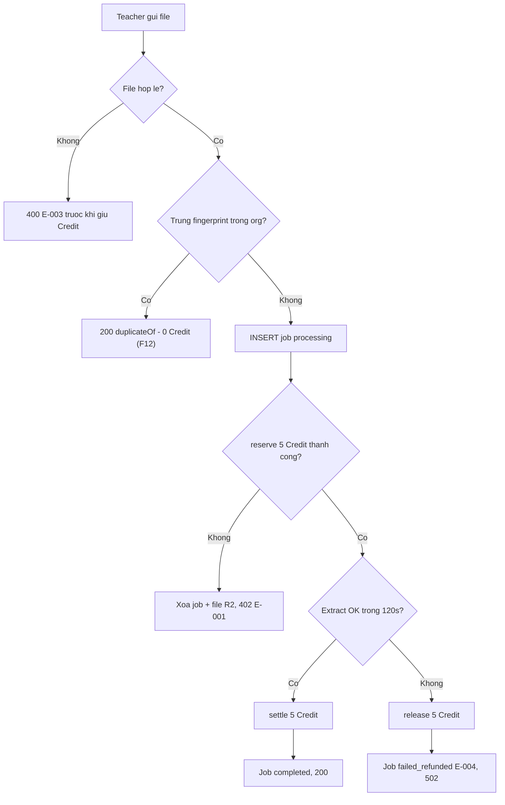
```mermaid
flowchart TD
    A["Teacher gui file"] --> B{"File hop le?"}
    B -->|"Khong"| C["400 E-003 truoc khi giu Credit"]
    B -->|"Co"| D{"Trung fingerprint trong org?"}
    D -->|"Co"| Z["200 duplicateOf - 0 Credit (F12)"]
    D -->|"Khong"| E["INSERT job processing"]
    E --> F{"reserve 5 Credit thanh cong?"}
    F -->|"Khong"| G["Xoa job + file R2, 402 E-001"]
    F -->|"Co"| H{"Extract OK trong 120s?"}
    H -->|"Co"| I["settle 5 Credit"]
    I --> J["Job completed, 200"]
    H -->|"Khong"| K["release 5 Credit"]
    K --> L["Job failed_refunded E-004, 502"]
```

## F3 — Nhập đề AI thiếu Credit (UC-03)

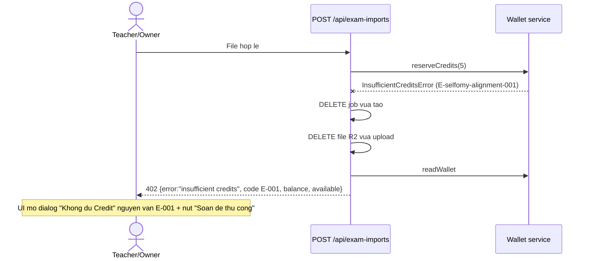
```mermaid
sequenceDiagram
    actor T as Teacher/Owner
    participant API as POST /api/exam-imports
    participant W as Wallet service
    T->>API: File hop le
    API->>W: reserveCredits(5)
    W--xAPI: InsufficientCreditsError (E-selfomy-alignment-001)
    API->>API: DELETE job vua tao
    API->>API: DELETE file R2 vua upload
    API->>W: readWallet
    API-->>T: 402 {error:"insufficient credits", code E-001, balance, available}
    Note over T: UI mo dialog "Khong du Credit" nguyen van E-001 + nut "Soan de thu cong"
```

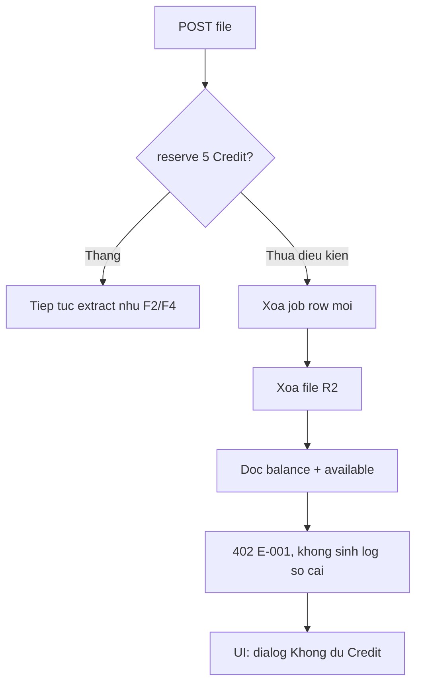
```mermaid
flowchart TD
    A["POST file"] --> B{"reserve 5 Credit?"}
    B -->|"Thang"| H["Tiep tuc extract nhu F2/F4"]
    B -->|"Thua dieu kien"| C["Xoa job row moi"]
    C --> D["Xoa file R2"]
    D --> E["Doc balance + available"]
    E --> F["402 E-001, khong sinh log so cai"]
    F --> G["UI: dialog Khong du Credit"]
```

## F4 — Nhập đề AI lỗi sau reserve (hoàn Credit) (UC-02 nhánh lỗi)

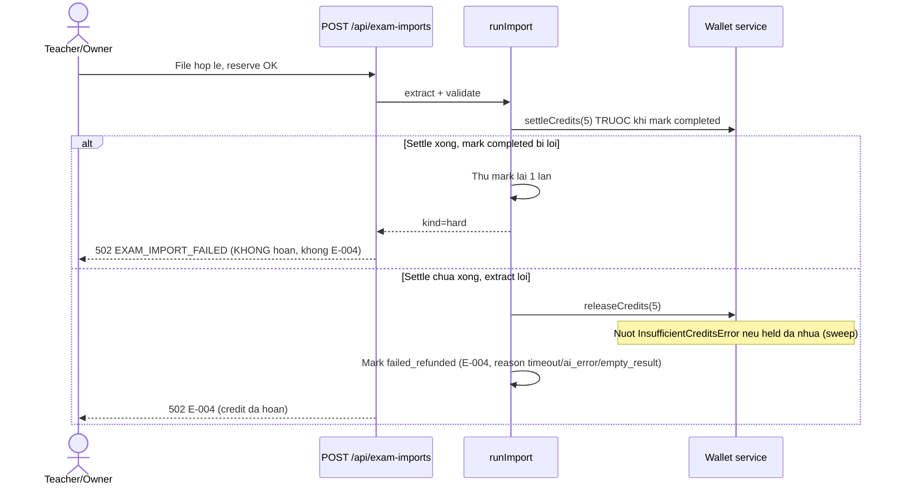
```mermaid
sequenceDiagram
    actor T as Teacher/Owner
    participant API as POST /api/exam-imports
    participant RI as runImport
    participant W as Wallet service
    T->>API: File hop le, reserve OK
    API->>RI: extract + validate
    RI->>W: settleCredits(5) TRUOC khi mark completed
    alt Settle xong, mark completed bi loi
        RI->>RI: Thu mark lai 1 lan
        RI-->>API: kind=hard
        API-->>T: 502 EXAM_IMPORT_FAILED (KHONG hoan, khong E-004)
    else Settle chua xong, extract loi
        RI->>W: releaseCredits(5)
        Note over W: Nuot InsufficientCreditsError neu held da nhua (sweep)
        RI->>RI: Mark failed_refunded (E-004, reason timeout/ai_error/empty_result)
        API-->>T: 502 E-004 (credit da hoan)
    end
```

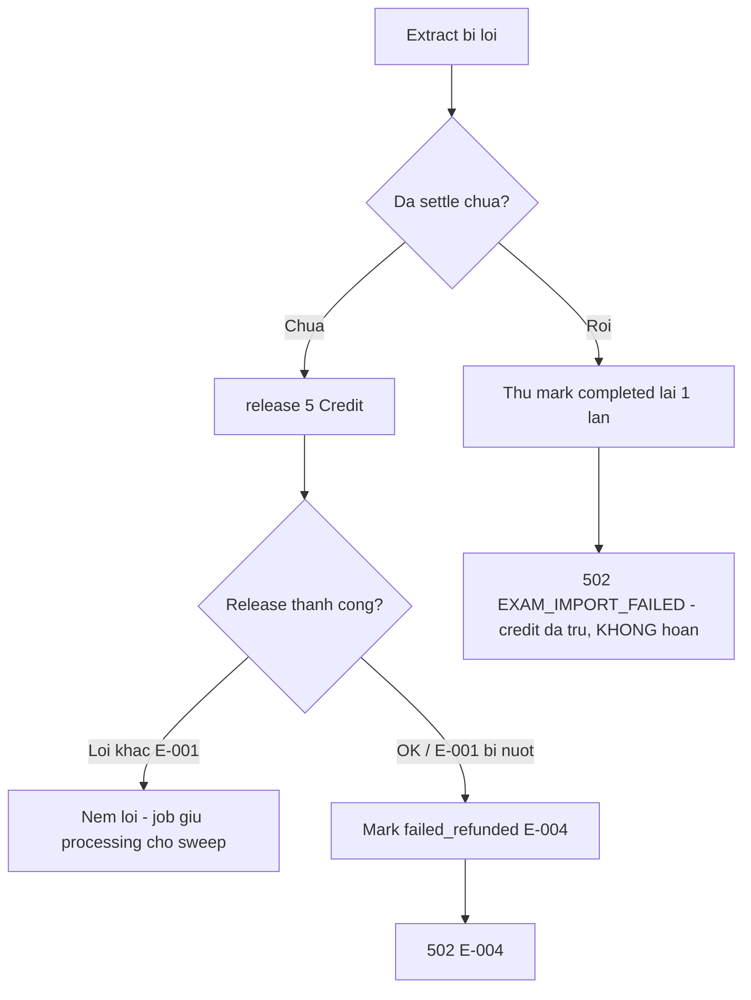
```mermaid
flowchart TD
    A["Extract bi loi"] --> B{"Da settle chua?"}
    B -->|"Chua"| C["release 5 Credit"]
    C --> D{"Release thanh cong?"}
    D -->|"Loi khac E-001"| E["Nem loi - job giu processing cho sweep"]
    D -->|"OK / E-001 bi nuot"| F["Mark failed_refunded E-004"]
    F --> G["502 E-004"]
    B -->|"Roi"| H["Thu mark completed lai 1 lan"]
    H --> I["502 EXAM_IMPORT_FAILED - credit da tru, KHONG hoan"]
```

## F5 — Retry nhập đề (UC-04)

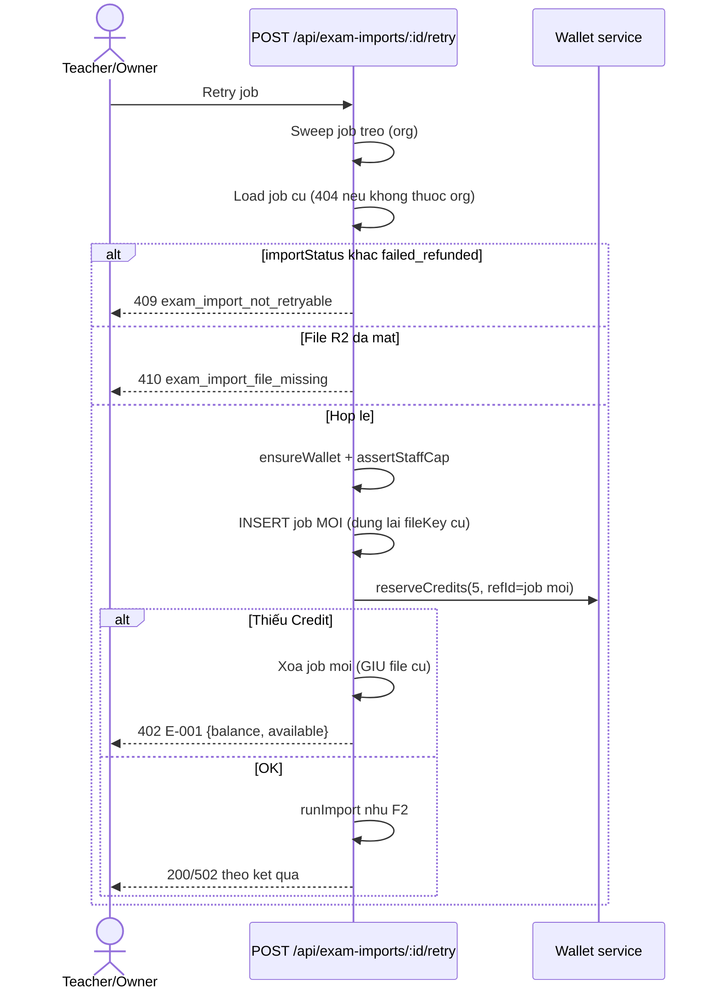
```mermaid
sequenceDiagram
    actor T as Teacher/Owner
    participant API as POST /api/exam-imports/:id/retry
    participant W as Wallet service
    T->>API: Retry job
    API->>API: Sweep job treo (org)
    API->>API: Load job cu (404 neu khong thuoc org)
    alt importStatus khac failed_refunded
        API-->>T: 409 exam_import_not_retryable
    else File R2 da mat
        API-->>T: 410 exam_import_file_missing
    else Hop le
        API->>API: ensureWallet + assertStaffCap
        API->>API: INSERT job MOI (dung lai fileKey cu)
        API->>W: reserveCredits(5, refId=job moi)
        alt Thiếu Credit
            API->>API: Xoa job moi (GIU file cu)
            API-->>T: 402 E-001 {balance, available}
        else OK
            API->>API: runImport nhu F2
            API-->>T: 200/502 theo ket qua
        end
    end
```

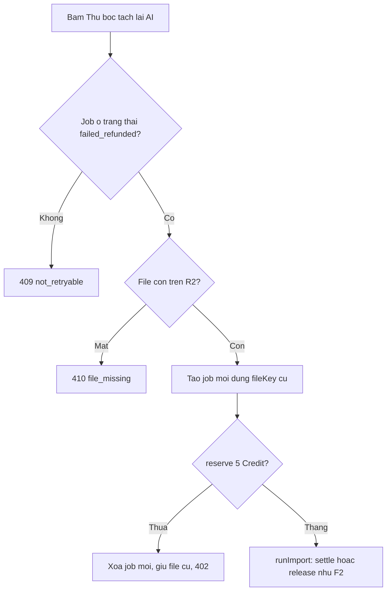
```mermaid
flowchart TD
    A["Bam Thu boc tach lai AI"] --> B{"Job o trang thai failed_refunded?"}
    B -->|"Khong"| C["409 not_retryable"]
    B -->|"Co"| D{"File con tren R2?"}
    D -->|"Mat"| E["410 file_missing"]
    D -->|"Con"| F["Tao job moi dung fileKey cu"]
    F --> G{"reserve 5 Credit?"}
    G -->|"Thua"| H["Xoa job moi, giu file cu, 402"]
    G -->|"Thang"| I["runImport: settle hoac release nhu F2"]
```

## F6 — Sweep job nhập đề treo (UC-08)

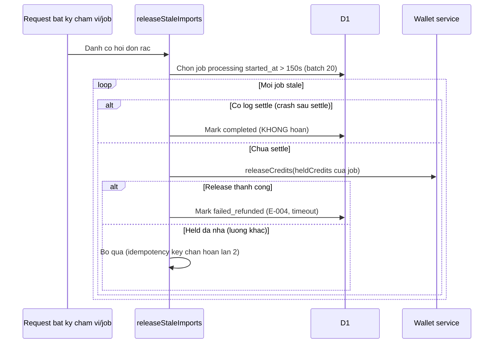
```mermaid
sequenceDiagram
    participant REQ as Request bat ky cham vi/job
    participant SW as releaseStaleImports
    participant DB as D1
    participant W as Wallet service
    REQ->>SW: Danh co hoi don rac
    SW->>DB: Chon job processing started_at > 150s (batch 20)
    loop Moi job stale
        alt Co log settle (crash sau settle)
            SW->>DB: Mark completed (KHONG hoan)
        else Chua settle
            SW->>W: releaseCredits(heldCredits cua job)
            alt Release thanh cong
                SW->>DB: Mark failed_refunded (E-004, timeout)
            else Held da nha (luong khac)
                SW->>SW: Bo qua (idempotency key chan hoan lan 2)
            end
        end
    end
```

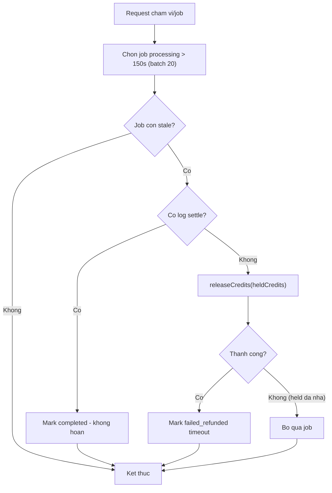
```mermaid
flowchart TD
    A["Request cham vi/job"] --> B["Chon job processing > 150s (batch 20)"]
    B --> C{"Job con stale?"}
    C -->|"Khong"| Z["Ket thuc"]
    C -->|"Co"| D{"Co log settle?"}
    D -->|"Co"| E["Mark completed - khong hoan"]
    D -->|"Khong"| F["releaseCredits(heldCredits)"]
    F --> G{"Thanh cong?"}
    G -->|"Co"| H["Mark failed_refunded timeout"]
    G -->|"Khong (held da nha)"| I["Bo qua job"]
    H --> Z
    E --> Z
    I --> Z
```

## F7 — Chấm AI đủ Credit (UC-05)

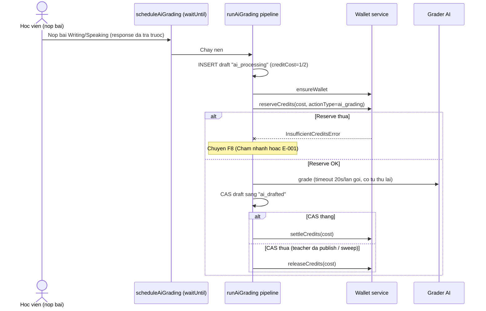
```mermaid
sequenceDiagram
    actor S as Hoc vien (nop bai)
    participant BG as scheduleAiGrading (waitUntil)
    participant PL as runAiGrading pipeline
    participant W as Wallet service
    participant AI as Grader AI
    S->>BG: Nop bai Writing/Speaking (response da tra truoc)
    BG->>PL: Chay nen
    PL->>PL: INSERT draft "ai_processing" (creditCost=1/2)
    PL->>W: ensureWallet
    PL->>W: reserveCredits(cost, actionType=ai_grading)
    alt Reserve thua
        W--xPL: InsufficientCreditsError
        Note over PL: Chuyen F8 (Cham nhanh hoac E-001)
    else Reserve OK
        PL->>AI: grade (timeout 20s/lan goi, co tu thu lai)
        PL->>PL: CAS draft sang "ai_drafted"
        alt CAS thang
            PL->>W: settleCredits(cost)
        else CAS thua (teacher da publish / sweep)
            PL->>W: releaseCredits(cost)
        end
    end
```

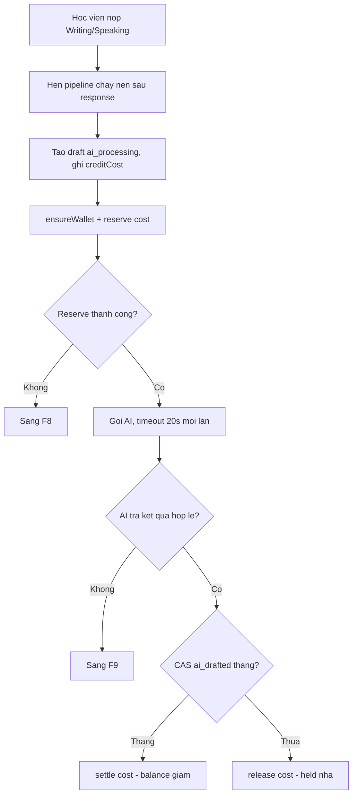
```mermaid
flowchart TD
    A["Hoc vien nop Writing/Speaking"] --> B["Hen pipeline chay nen sau response"]
    B --> C["Tao draft ai_processing, ghi creditCost"]
    C --> D["ensureWallet + reserve cost"]
    D --> E{"Reserve thanh cong?"}
    E -->|"Khong"| F["Sang F8"]
    E -->|"Co"| G["Goi AI, timeout 20s moi lan"]
    G --> H{"AI tra ket qua hop le?"}
    H -->|"Khong"| I["Sang F9"]
    H -->|"Co"| J{"CAS ai_drafted thang?"}
    J -->|"Thang"| K["settle cost - balance giam"]
    J -->|"Thua"| L["release cost - held nha"]
```

## F8 — Chấm AI hết Credit → Chấm nhanh Writing (UC-06)

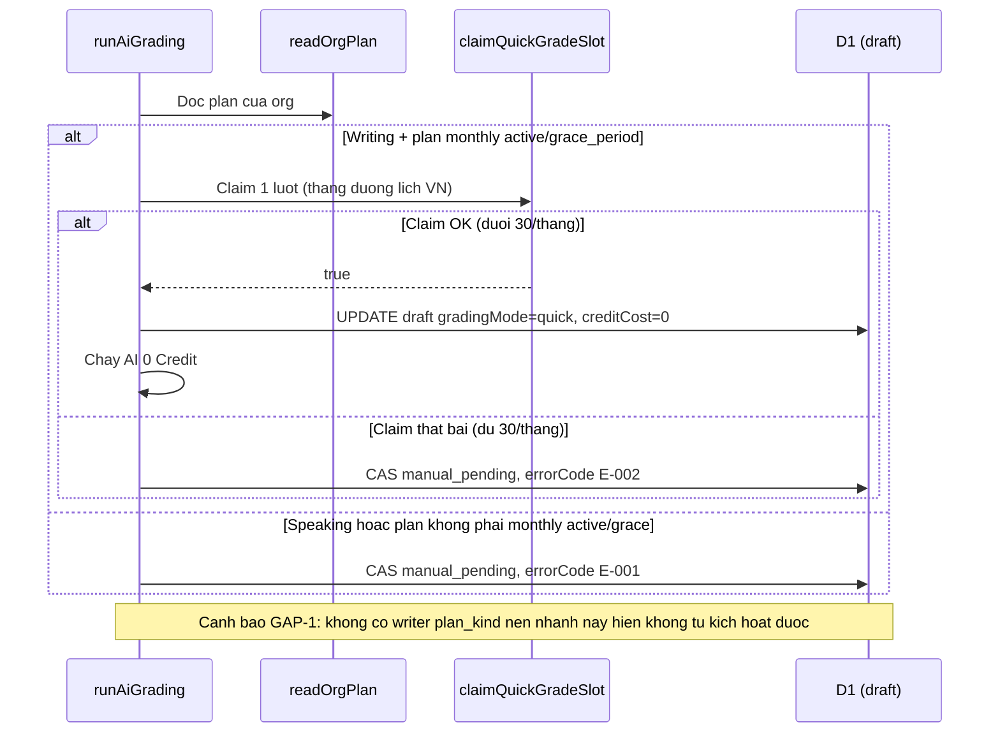
```mermaid
sequenceDiagram
    participant PL as runAiGrading
    participant WP as readOrgPlan
    participant QG as claimQuickGradeSlot
    participant DB as D1 (draft)
    PL->>WP: Doc plan cua org
    alt Writing + plan monthly active/grace_period
        PL->>QG: Claim 1 luot (thang duong lich VN)
        alt Claim OK (duoi 30/thang)
            QG-->>PL: true
            PL->>DB: UPDATE draft gradingMode=quick, creditCost=0
            PL->>PL: Chay AI 0 Credit
        else Claim that bai (du 30/thang)
            PL->>DB: CAS manual_pending, errorCode E-002
        end
    else Speaking hoac plan khong phai monthly active/grace
        PL->>DB: CAS manual_pending, errorCode E-001
    end
    Note over PL,DB: Canh bao GAP-1: khong co writer plan_kind nen nhanh nay hien khong tu kich hoat duoc
```

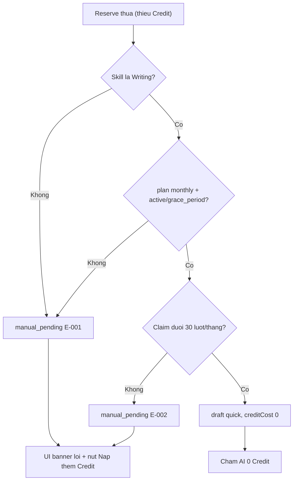
```mermaid
flowchart TD
    A["Reserve thua (thieu Credit)"] --> B{"Skill la Writing?"}
    B -->|"Khong"| X["manual_pending E-001"]
    B -->|"Co"| C{"plan monthly + active/grace_period?"}
    C -->|"Khong"| X
    C -->|"Co"| D{"Claim duoi 30 luot/thang?"}
    D -->|"Khong"| Y["manual_pending E-002"]
    D -->|"Co"| E["draft quick, creditCost 0"]
    E --> F["Cham AI 0 Credit"]
    X --> Z["UI banner loi + nut Nap them Credit"]
    Y --> Z
```

## F9 — Chấm AI lỗi (hoàn Credit / hoàn lượt quick) (UC-05 nhánh lỗi)

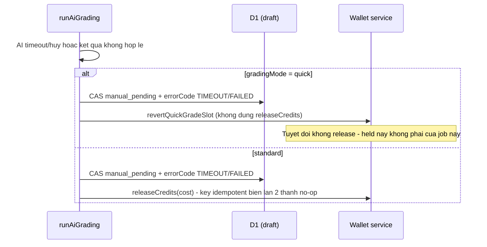
```mermaid
sequenceDiagram
    participant PL as runAiGrading
    participant DB as D1 (draft)
    participant W as Wallet service
    PL->>PL: AI timeout/huy hoac ket qua khong hop le
    alt gradingMode = quick
        PL->>DB: CAS manual_pending + errorCode TIMEOUT/FAILED
        PL->>W: revertQuickGradeSlot (khong dung releaseCredits)
        Note over W: Tuyet doi khong release - held nay khong phai cua job nay
    else standard
        PL->>DB: CAS manual_pending + errorCode TIMEOUT/FAILED
        PL->>W: releaseCredits(cost) - key idempotent bien lan 2 thanh no-op
    end
```

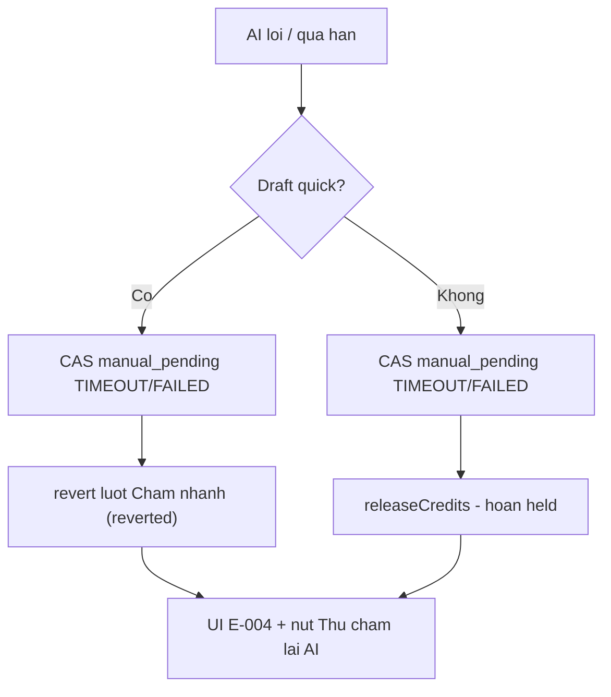
```mermaid
flowchart TD
    A["AI loi / qua han"] --> B{"Draft quick?"}
    B -->|"Co"| C["CAS manual_pending TIMEOUT/FAILED"]
    C --> D["revert luot Cham nhanh (reverted)"]
    B -->|"Khong"| E["CAS manual_pending TIMEOUT/FAILED"]
    E --> F["releaseCredits - hoan held"]
    D --> G["UI E-004 + nut Thu cham lai AI"]
    F --> G
```

## F10 — Sweep draft chấm AI treo (UC-08)

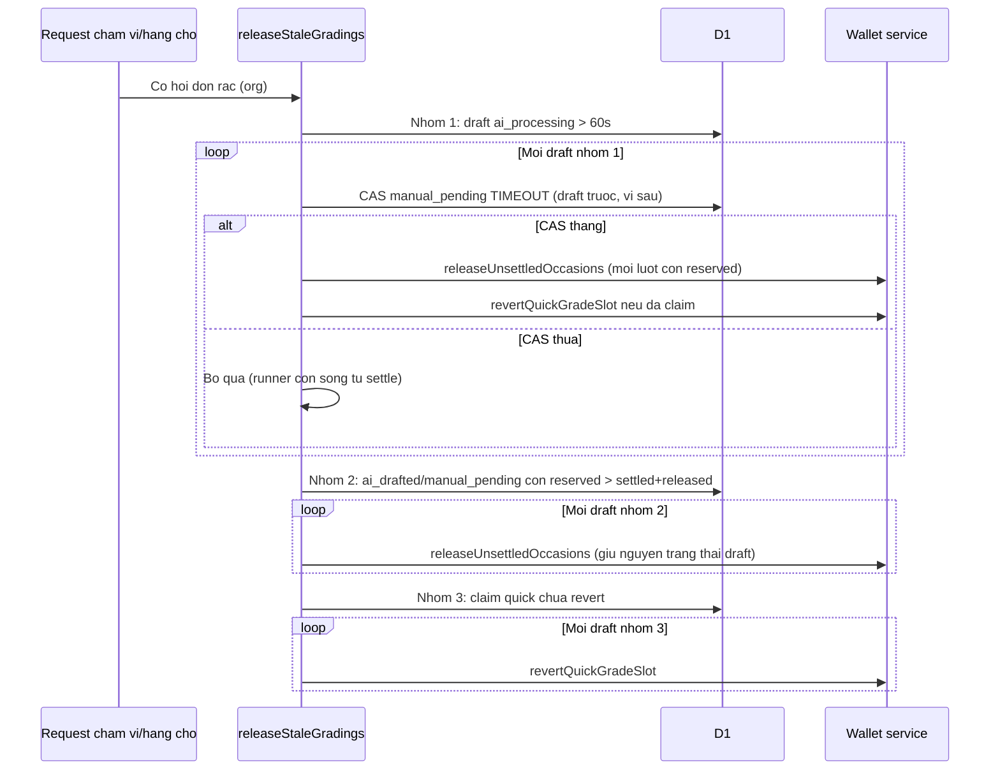
```mermaid
sequenceDiagram
    participant REQ as Request cham vi/hang cho
    participant SW as releaseStaleGradings
    participant DB as D1
    participant W as Wallet service
    REQ->>SW: Co hoi don rac (org)
    SW->>DB: Nhom 1: draft ai_processing > 60s
    loop Moi draft nhom 1
        SW->>DB: CAS manual_pending TIMEOUT (draft truoc, vi sau)
        alt CAS thang
            SW->>W: releaseUnsettledOccasions (moi luot con reserved)
            SW->>W: revertQuickGradeSlot neu da claim
        else CAS thua
            SW->>SW: Bo qua (runner con song tu settle)
        end
    end
    SW->>DB: Nhom 2: ai_drafted/manual_pending con reserved > settled+released
    loop Moi draft nhom 2
        SW->>W: releaseUnsettledOccasions (giu nguyen trang thai draft)
    end
    SW->>DB: Nhom 3: claim quick chua revert
    loop Moi draft nhom 3
        SW->>W: revertQuickGradeSlot
    end
```

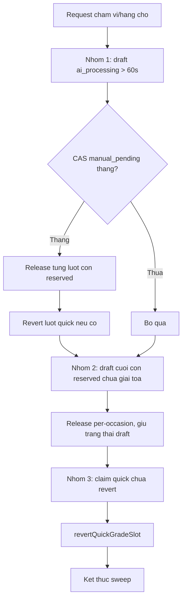
```mermaid
flowchart TD
    A["Request cham vi/hang cho"] --> B["Nhom 1: draft ai_processing > 60s"]
    B --> C{"CAS manual_pending thang?"}
    C -->|"Thang"| D["Release tung luot con reserved"]
    D --> E["Revert luot quick neu co"]
    C -->|"Thua"| F["Bo qua"]
    E --> G["Nhom 2: draft cuoi con reserved chua giai toa"]
    F --> G
    G --> H["Release per-occasion, giu trang thai draft"]
    H --> I["Nhom 3: claim quick chua revert"]
    I --> J["revertQuickGradeSlot"]
    J --> K["Ket thuc sweep"]
```

## F11 — Thử chấm lại AI (UC-07)

```mermaid
sequenceDiagram
    actor V as Vai duoc publish (teacher/owner/admin/class_teacher)
    participant API as POST /api/grading/:id/ai-retry
    participant W as Wallet service
    V->>API: Bam "Thu cham lai AI"
    API->>API: Kiem tra vai (403 AI_RETRY_FORBIDDEN neu TA)
    API->>API: Load draft (404 neu khong co)
    alt Draft khong o manual_pending
        API-->>V: 409 E-011 (dang xu ly)
    else errorCode khong retryable
        API-->>V: 409 DRAFT_NOT_RETRYABLE
    else Hop le
        API->>W: releaseUnsettledOccasions (don luot cu bi crash)
        API->>API: CAS manual_pending sang ai_processing, retryCount+1
        alt CAS thang
            API->>API: scheduleAiGrading (retryCount moi)
            Note over W: Pipeline se reserve bo khoa ai_grading:id:r(n)
            API-->>V: 200 draft view
        else CAS thua
            API-->>V: 409 E-011, khong reserve
        end
    end
```

```mermaid
flowchart TD
    A["Bam Thu cham lai AI"] --> B{"Vai duoc publish?"}
    B -->|"Khong"| C["403 AI_RETRY_FORBIDDEN"]
    B -->|"Co"| D{"manual_pending + loi retryable?"}
    D -->|"Khong"| E["409"]
    D -->|"Co"| F["Don luot cu con reserved"]
    F --> G{"CAS sang ai_processing thang?"}
    G -->|"Thang"| H["retryCount + 1, hen pipeline reserve bo r(n)"]
    G -->|"Thua"| I["409 E-011, khong reserve"]
```

## F12 — Trùng đề, 0 Credit (UC-09)

```mermaid
sequenceDiagram
    actor T as Teacher/Owner
    participant API as POST /api/exam-imports
    T->>API: Upload file trung fingerprint (da import completed)
    API->>API: Sweep job treo
    API->>API: findCompletedImportByFingerprint
    alt Trung (job completed co draft doc duoc)
        API-->>T: 200 {duplicateOf: {jobId, title, completedAt}}
        Note over API: Khong goi AI, khong luu R2, khong reserve/tru Credit
    else Khong trung
        API->>API: Tiep tuc F2
    end
```

```mermaid
flowchart TD
    A["POST file"] --> B{"Fingerprint da ton tai (completed, co draft)?"}
    B -->|"Co"| C["200 duplicateOf - 0 Credit tuyet doi"]
    B -->|"Khong"| D["Di tiep luong F2"]
```
