# Luồng nghiệp vụ — grading (mỗi flow: sequence + flowchart)

Chỉ vẽ các bước CÓ trong code. Nguồn cho từng bước ghi cạnh bước trong phần chú thích dưới mỗi diagram.

## F1 — Học viên nộp bài kích hoạt chấm AI

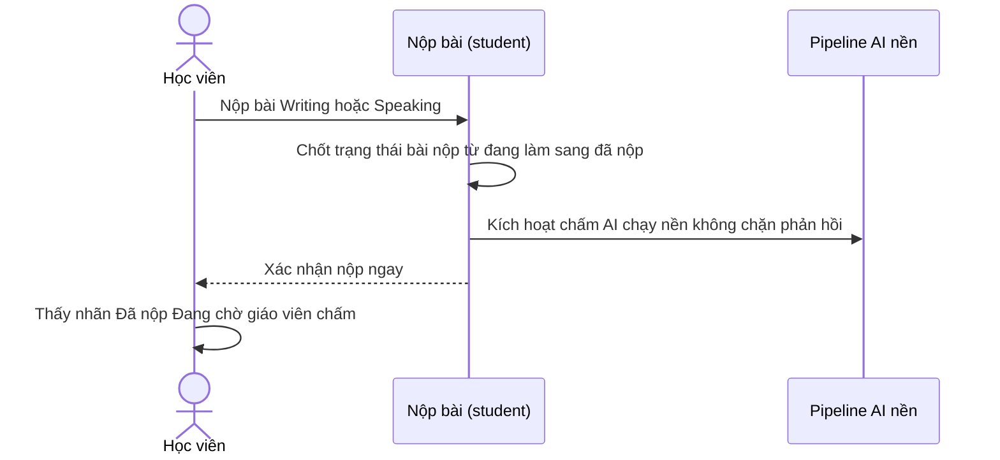
```mermaid
sequenceDiagram
    actor HV as Học viên
    participant API as Nộp bài (student)
    participant BG as Pipeline AI nền
    HV->>API: Nộp bài Writing hoặc Speaking
    API->>API: Chốt trạng thái bài nộp từ đang làm sang đã nộp
    API->>BG: Kích hoạt chấm AI chạy nền không chặn phản hồi
    API-->>HV: Xác nhận nộp ngay
    HV->>HV: Thấy nhãn Đã nộp Đang chờ giáo viên chấm
```

Nguồn: apps/server/src/routes/student.ts:1939-1950 (CAS flip), :1954-1961 (void scheduleAiGrading L1961); apps/student/src/routes/_auth/learn/quizzes/attempt/$attemptId.tsx:144.

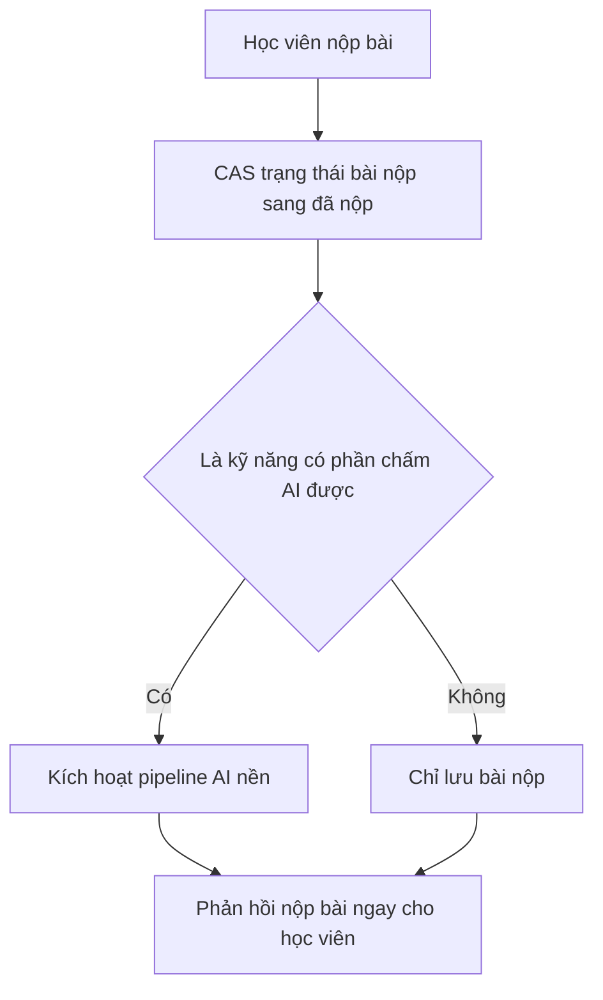
```mermaid
flowchart TD
    A["Học viên nộp bài"] --> B["CAS trạng thái bài nộp sang đã nộp"]
    B --> C{"Là kỹ năng có phần chấm AI được"}
    C -->|"Có"| D["Kích hoạt pipeline AI nền"]
    C -->|"Không"| E["Chỉ lưu bài nộp"]
    D --> F["Phản hồi nộp bài ngay cho học viên"]
    E --> F
```

Nguồn: apps/server/src/routes/student.ts:1939-1961.

## F2 — Pipeline chấm AI (kèm nhánh lỗi Credit và lỗi AI)

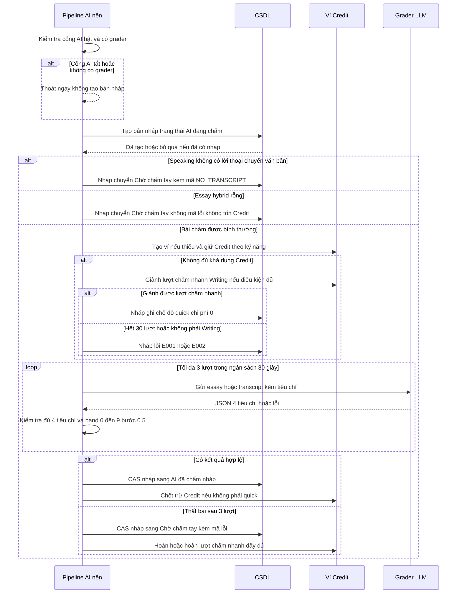
```mermaid
sequenceDiagram
    participant BG as Pipeline AI nền
    participant DB as CSDL
    participant W as Ví Credit
    participant AI as Grader LLM
    BG->>BG: Kiểm tra cổng AI bật và có grader
    alt Cổng AI tắt hoặc không có grader
        BG-->>BG: Thoát ngay không tạo bản nháp
    end
    BG->>DB: Tạo bản nháp trạng thái AI đang chấm
    DB-->>BG: Đã tạo hoặc bỏ qua nếu đã có nháp
    alt Speaking không có lời thoại chuyển văn bản
        BG->>DB: Nháp chuyển Chờ chấm tay kèm mã NO_TRANSCRIPT
    else Essay hybrid rỗng
        BG->>DB: Nháp chuyển Chờ chấm tay không mã lỗi không tốn Credit
    else Bài chấm được bình thường
        BG->>W: Tạo ví nếu thiếu và giữ Credit theo kỹ năng
        alt Không đủ khả dụng Credit
            BG->>W: Giành lượt chấm nhanh Writing nếu điều kiện đủ
            alt Giành được lượt chấm nhanh
                BG->>DB: Nháp ghi chế độ quick chi phí 0
            else Hết 30 lượt hoặc không phải Writing
                BG->>DB: Nháp lỗi E001 hoặc E002
            end
        end
        loop Tối đa 3 lượt trong ngân sách 30 giây
            BG->>AI: Gửi essay hoặc transcript kèm tiêu chí
            AI-->>BG: JSON 4 tiêu chí hoặc lỗi
            BG->>BG: Kiểm tra đủ 4 tiêu chí và band 0 đến 9 bước 0.5
        end
        alt Có kết quả hợp lệ
            BG->>DB: CAS nháp sang AI đã chấm nháp
            BG->>W: Chốt trừ Credit nếu không phải quick
        else Thất bại sau 3 lượt
            BG->>DB: CAS nháp sang Chờ chấm tay kèm mã lỗi
            BG->>W: Hoàn hoặc hoàn lượt chấm nhanh đầy đủ
        end
    end
```

Nguồn: apps/server/src/lib/ai-grading/run-grading.ts:329-337 (gate), :344-356 (INSERT draft), :371-383 (NO_TRANSCRIPT), :386-395 (essay rỗng), :400-439 (reserve + quick + E-001/E-002), :464-515 (vòng 3 lượt + backoff + timeout), :517-551 (fail/CAS/settle); apps/server/src/lib/credits/wallet.ts:88-95, 163-202, 324-346; apps/server/src/lib/ai-grading/workers-ai-grader.ts:29-63, 164.

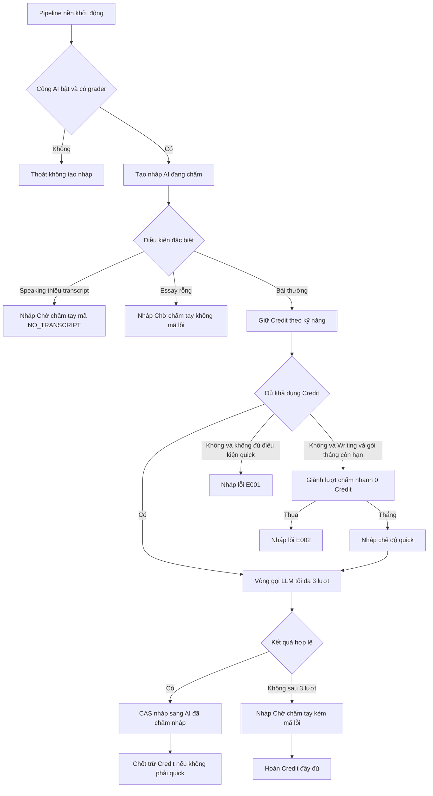
```mermaid
flowchart TD
    A["Pipeline nền khởi động"] --> B{"Cổng AI bật và có grader"}
    B -->|"Không"| Z["Thoát không tạo nháp"]
    B -->|"Có"| C["Tạo nháp AI đang chấm"]
    C --> D{"Điều kiện đặc biệt"}
    D -->|"Speaking thiếu transcript"| E["Nháp Chờ chấm tay mã NO_TRANSCRIPT"]
    D -->|"Essay rỗng"| F["Nháp Chờ chấm tay không mã lỗi"]
    D -->|"Bài thường"| G["Giữ Credit theo kỹ năng"]
    G --> H{"Đủ khả dụng Credit"}
    H -->|"Không và Writing và gói tháng còn hạn"| I["Giành lượt chấm nhanh 0 Credit"]
    I -->|"Thắng"| J["Nháp chế độ quick"]
    I -->|"Thua"| K["Nháp lỗi E002"]
    H -->|"Không và không đủ điều kiện quick"| L["Nháp lỗi E001"]
    H -->|"Có"| M["Vòng gọi LLM tối đa 3 lượt"]
    J --> M
    M --> N{"Kết quả hợp lệ"}
    N -->|"Có"| O["CAS nháp sang AI đã chấm nháp"]
    O --> P["Chốt trừ Credit nếu không phải quick"]
    N -->|"Không sau 3 lượt"| Q["Nháp Chờ chấm tay kèm mã lỗi"]
    Q --> R["Hoàn Credit đầy đủ"]
```

Nguồn: như trên (run-grading.ts; wallet.ts).

## F3 — Mở hàng chờ chấm

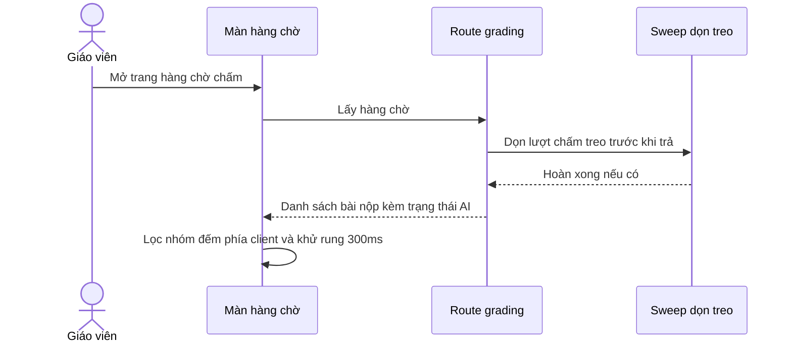
```mermaid
sequenceDiagram
    actor GV as Giáo viên
    participant UI as Màn hàng chờ
    participant API as Route grading
    participant SW as Sweep dọn treo
    GV->>UI: Mở trang hàng chờ chấm
    UI->>API: Lấy hàng chờ
    API->>SW: Dọn lượt chấm treo trước khi trả
    SW-->>API: Hoàn xong nếu có
    API-->>UI: Danh sách bài nộp kèm trạng thái AI
    UI->>UI: Lọc nhóm đếm phía client và khử rung 300ms
```

Nguồn: apps/server/src/routes/grading.ts:720-730 (sweep L726), :126-330 (tải queue), :638-663 (item + aiStatus); apps/web/src/routes/_auth/grading/index.tsx:56-82, 193-204, 243-301.

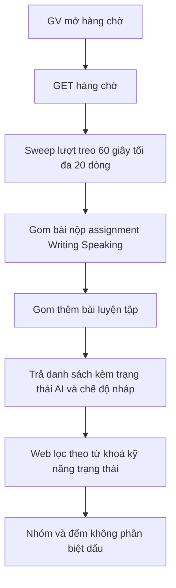
```mermaid
flowchart TD
    A["GV mở hàng chờ"] --> B["GET hàng chờ"]
    B --> C["Sweep lượt treo 60 giây tối đa 20 dòng"]
    C --> D["Gom bài nộp assignment Writing Speaking"]
    D --> E["Gom thêm bài luyện tập"]
    E --> F["Trả danh sách kèm trạng thái AI và chế độ nháp"]
    F --> G["Web lọc theo từ khoá kỹ năng trạng thái"]
    G --> H["Nhóm và đếm không phân biệt dấu"]
```

Nguồn: apps/server/src/routes/grading.ts:84, 126-330, 638-663; apps/web/src/routes/_auth/grading/index.tsx:56-82, 243-301.

## F4 — Mở một bài nộp để chấm

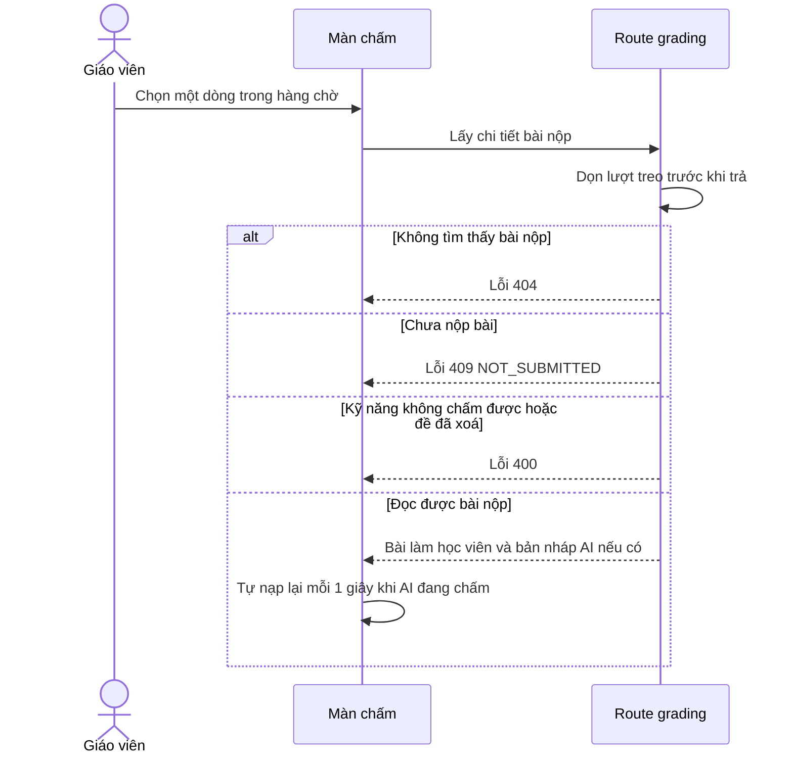
```mermaid
sequenceDiagram
    actor GV as Giáo viên
    participant UI as Màn chấm
    participant API as Route grading
    GV->>UI: Chọn một dòng trong hàng chờ
    UI->>API: Lấy chi tiết bài nộp
    API->>API: Dọn lượt treo trước khi trả
    alt Không tìm thấy bài nộp
        API-->>UI: Lỗi 404
    else Chưa nộp bài
        API-->>UI: Lỗi 409 NOT_SUBMITTED
    else Kỹ năng không chấm được hoặc đề đã xoá
        API-->>UI: Lỗi 400
    else Đọc được bài nộp
        API-->>UI: Bài làm học viên và bản nháp AI nếu có
        UI->>UI: Tự nạp lại mỗi 1 giây khi AI đang chấm
    end
```

Nguồn: apps/server/src/routes/grading.ts:946-968 (sweep L951), :468-663 (checks 409/400), :665-679 (errorResponse); apps/web/src/routes/_auth/grading/$attemptId.tsx:75-77, 240-247.

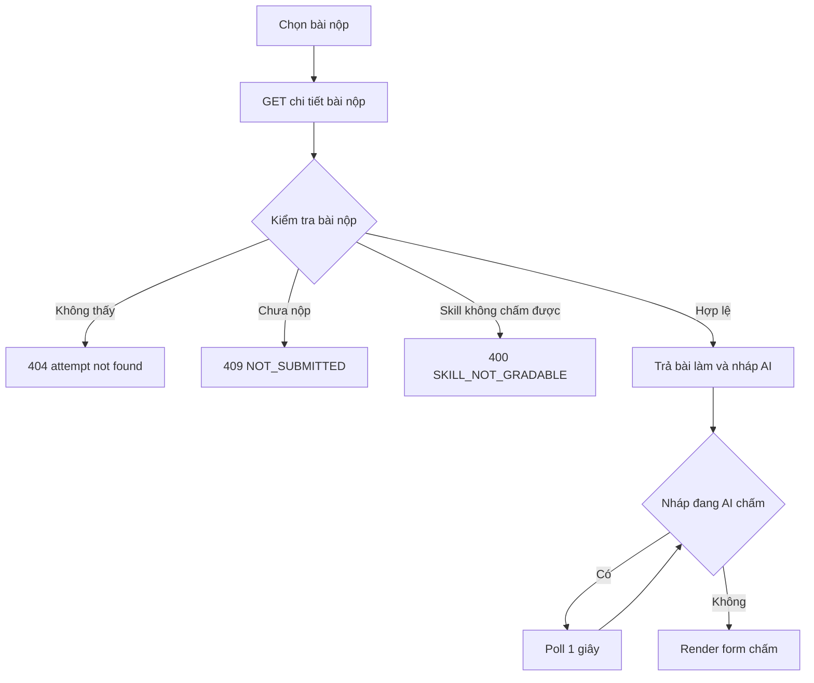
```mermaid
flowchart TD
    A["Chọn bài nộp"] --> B["GET chi tiết bài nộp"]
    B --> C{"Kiểm tra bài nộp"}
    C -->|"Không thấy"| D["404 attempt not found"]
    C -->|"Chưa nộp"| E["409 NOT_SUBMITTED"]
    C -->|"Skill không chấm được"| F["400 SKILL_NOT_GRADABLE"]
    C -->|"Hợp lệ"| G["Trả bài làm và nháp AI"]
    G --> H{"Nháp đang AI chấm"}
    H -->|"Có"| I["Poll 1 giây"]
    I --> H
    H -->|"Không"| J["Render form chấm"]
```

Nguồn: apps/server/src/routes/grading.ts:468-679, 946-968; apps/web/src/routes/_auth/grading/$attemptId.tsx:75-77.

## F5 — Lưu bản nháp rà soát kèm xung đột E-011

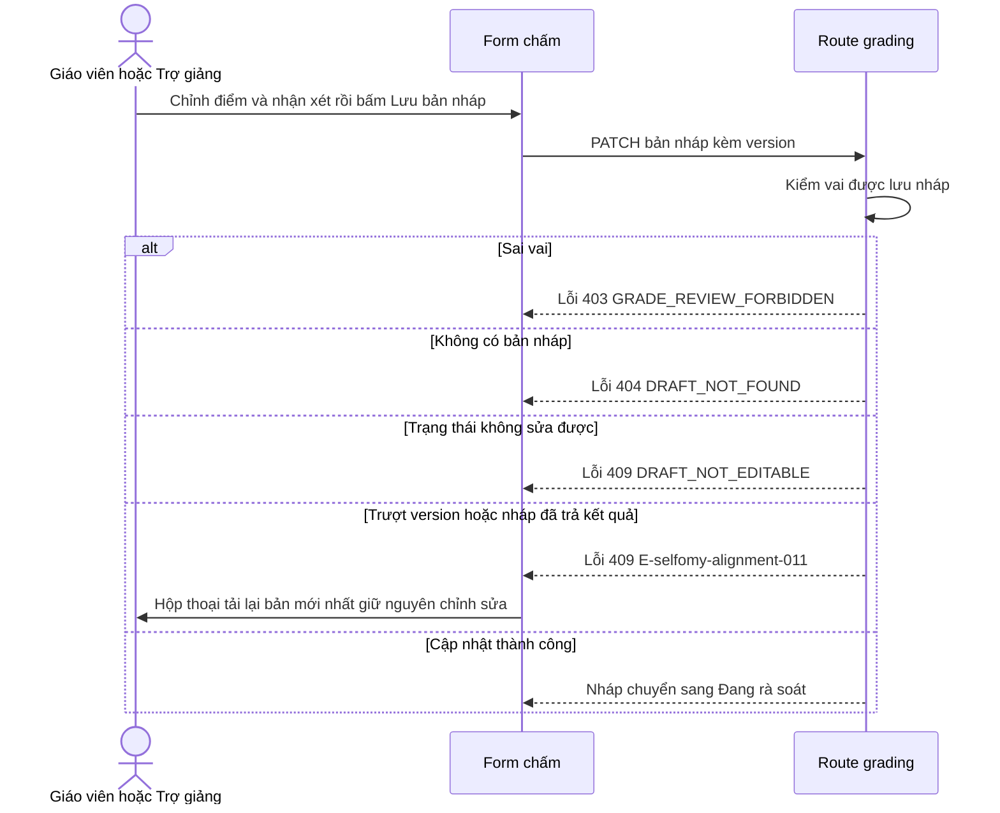
```mermaid
sequenceDiagram
    actor ST as Giáo viên hoặc Trợ giảng
    participant UI as Form chấm
    participant API as Route grading
    ST->>UI: Chỉnh điểm và nhận xét rồi bấm Lưu bản nháp
    UI->>API: PATCH bản nháp kèm version
    API->>API: Kiểm vai được lưu nháp
    alt Sai vai
        API-->>UI: Lỗi 403 GRADE_REVIEW_FORBIDDEN
    else Không có bản nháp
        API-->>UI: Lỗi 404 DRAFT_NOT_FOUND
    else Trạng thái không sửa được
        API-->>UI: Lỗi 409 DRAFT_NOT_EDITABLE
    else Trượt version hoặc nháp đã trả kết quả
        API-->>UI: Lỗi 409 E-selfomy-alignment-011
        UI->>ST: Hộp thoại tải lại bản mới nhất giữ nguyên chỉnh sửa
    else Cập nhật thành công
        API-->>UI: Nháp chuyển sang Đang rà soát
    end
```

Nguồn: apps/server/src/routes/grading.ts:421-425 (EDITABLE_DRAFT_STATUSES), :1142-1221 (gate 1149, 404 1177, 409 1179-1190, guard 1208); apps/web/src/routes/_auth/grading/$attemptId.tsx:61-67, 434-463, 467-503; apps/web/src/components/grading/grade-form.tsx:140-159.

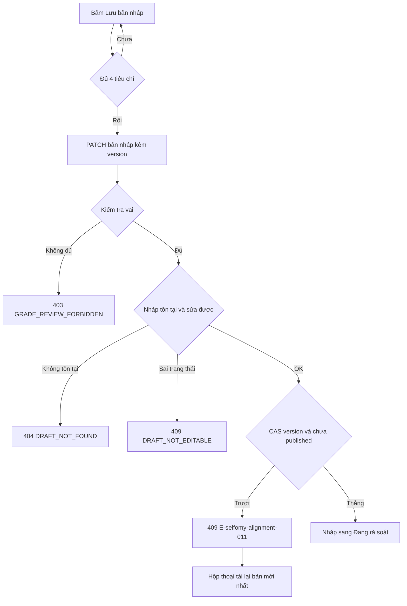
```mermaid
flowchart TD
    A["Bấm Lưu bản nháp"] --> B{"Đủ 4 tiêu chí"}
    B -->|"Chưa"| A
    B -->|"Rồi"| C["PATCH bản nháp kèm version"]
    C --> D{"Kiểm tra vai"}
    D -->|"Không đủ"| E["403 GRADE_REVIEW_FORBIDDEN"]
    D -->|"Đủ"| F{"Nháp tồn tại và sửa được"}
    F -->|"Không tồn tại"| G["404 DRAFT_NOT_FOUND"]
    F -->|"Sai trạng thái"| H["409 DRAFT_NOT_EDITABLE"]
    F -->|"OK"| I{"CAS version và chưa published"}
    I -->|"Trượt"| J["409 E-selfomy-alignment-011"]
    J --> K["Hộp thoại tải lại bản mới nhất"]
    I -->|"Thắng"| L["Nháp sang Đang rà soát"]
```

Nguồn: apps/server/src/routes/grading.ts:1142-1221; apps/web/src/routes/_auth/grading/$attemptId.tsx:61-67, 467-503.

## F6 — Chốt trả bài + thông báo học viên

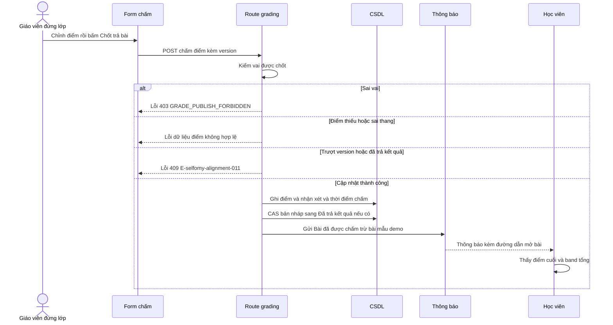
```mermaid
sequenceDiagram
    actor GV as Giáo viên đứng lớp
    participant UI as Form chấm
    participant API as Route grading
    participant DB as CSDL
    participant NT as Thông báo
    participant HV as Học viên
    GV->>UI: Chỉnh điểm rồi bấm Chốt trả bài
    UI->>API: POST chấm điểm kèm version
    API->>API: Kiểm vai được chốt
    alt Sai vai
        API-->>UI: Lỗi 403 GRADE_PUBLISH_FORBIDDEN
    else Điểm thiếu hoặc sai thang
        API-->>UI: Lỗi dữ liệu điểm không hợp lệ
    else Trượt version hoặc đã trả kết quả
        API-->>UI: Lỗi 409 E-selfomy-alignment-011
    else Cập nhật thành công
        API->>DB: Ghi điểm và nhận xét và thời điểm chấm
        API->>DB: CAS bản nháp sang Đã trả kết quả nếu có
        API->>NT: Gửi Bài đã được chấm trừ bài mẫu demo
        NT-->>HV: Thông báo kèm đường dẫn mở bài
        HV->>HV: Thấy điểm cuối và band tổng
    end
```

Nguồn: apps/server/src/routes/grading.ts:998-1132 (gate 1003-1008, validate 1017-1020, CAS 1065-1100, notify 1115-1130); apps/server/src/lib/notifications/templates.ts:111-127; apps/web/src/components/grading/grade-form.tsx:160-168.

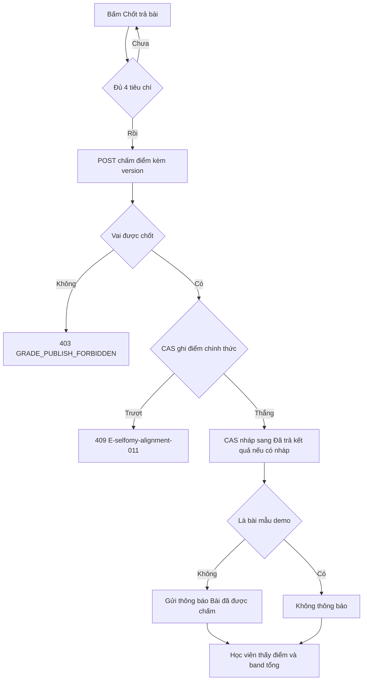
```mermaid
flowchart TD
    A["Bấm Chốt trả bài"] --> B{"Đủ 4 tiêu chí"}
    B -->|"Chưa"| A
    B -->|"Rồi"| C["POST chấm điểm kèm version"]
    C --> D{"Vai được chốt"}
    D -->|"Không"| E["403 GRADE_PUBLISH_FORBIDDEN"]
    D -->|"Có"| F{"CAS ghi điểm chính thức"}
    F -->|"Trượt"| G["409 E-selfomy-alignment-011"]
    F -->|"Thắng"| H["CAS nháp sang Đã trả kết quả nếu có nháp"]
    H --> I{"Là bài mẫu demo"}
    I -->|"Có"| J["Không thông báo"]
    I -->|"Không"| K["Gửi thông báo Bài đã được chấm"]
    K --> L["Học viên thấy điểm và band tổng"]
    J --> L
```

Nguồn: apps/server/src/routes/grading.ts:998-1132; apps/student/src/routes/_auth/learn/quizzes/attempt/$attemptId.tsx:144.

## F7 — Thử chấm lại AI

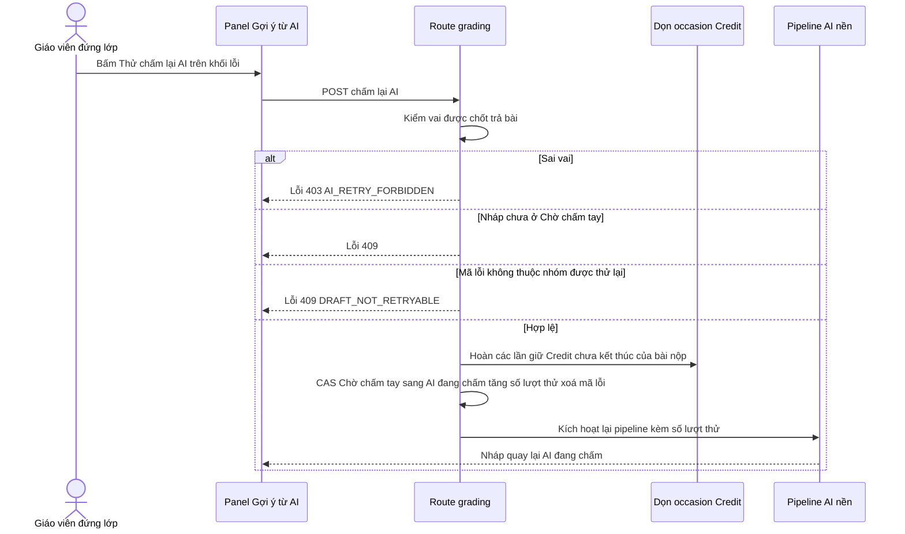
```mermaid
sequenceDiagram
    actor GV as Giáo viên đứng lớp
    participant UI as Panel Gợi ý từ AI
    participant API as Route grading
    participant REL as Dọn occasion Credit
    participant BG as Pipeline AI nền
    GV->>UI: Bấm Thử chấm lại AI trên khối lỗi
    UI->>API: POST chấm lại AI
    API->>API: Kiểm vai được chốt trả bài
    alt Sai vai
        API-->>UI: Lỗi 403 AI_RETRY_FORBIDDEN
    else Nháp chưa ở Chờ chấm tay
        API-->>UI: Lỗi 409
    else Mã lỗi không thuộc nhóm được thử lại
        API-->>UI: Lỗi 409 DRAFT_NOT_RETRYABLE
    else Hợp lệ
        API->>REL: Hoàn các lần giữ Credit chưa kết thúc của bài nộp
        API->>API: CAS Chờ chấm tay sang AI đang chấm tăng số lượt thử xoá mã lỗi
        API->>BG: Kích hoạt lại pipeline kèm số lượt thử
        BG-->>UI: Nháp quay lại AI đang chấm
    end
```

Nguồn: apps/server/src/routes/grading.ts:1235-1334 (gate 1238-1243, 409 1264-1278, release 1285-1291, CAS 1292-1306, schedule 1322-1332); apps/server/src/lib/ai-grading/release-stale.ts:180-230; apps/web/src/components/grading/ai-draft-panel.tsx:133-142, 248-284.

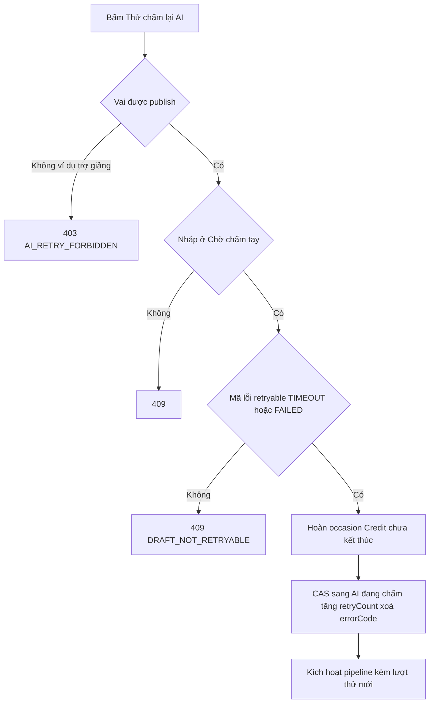
```mermaid
flowchart TD
    A["Bấm Thử chấm lại AI"] --> B{"Vai được publish"}
    B -->|"Không ví dụ trợ giảng"| C["403 AI_RETRY_FORBIDDEN"]
    B -->|"Có"| D{"Nháp ở Chờ chấm tay"}
    D -->|"Không"| E["409"]
    D -->|"Có"| F{"Mã lỗi retryable TIMEOUT hoặc FAILED"}
    F -->|"Không"| G["409 DRAFT_NOT_RETRYABLE"]
    F -->|"Có"| H["Hoàn occasion Credit chưa kết thúc"]
    H --> I["CAS sang AI đang chấm tăng retryCount xoá errorCode"]
    I --> J["Kích hoạt pipeline kèm lượt thử mới"]
```

Nguồn: apps/server/src/routes/grading.ts:1235-1334; packages/api/src/contracts.ts:4219-4230.

## F8 — Sweep dọn lượt chấm treo và hoàn Credit

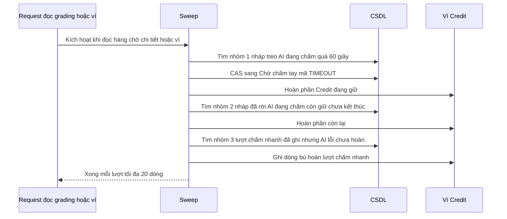
```mermaid
sequenceDiagram
    participant REQ as Request đọc grading hoặc ví
    participant SW as Sweep
    participant DB as CSDL
    participant W as Ví Credit
    REQ->>SW: Kích hoạt khi đọc hàng chờ chi tiết hoặc ví
    SW->>DB: Tìm nhóm 1 nháp treo AI đang chấm quá 60 giây
    SW->>DB: CAS sang Chờ chấm tay mã TIMEOUT
    SW->>W: Hoàn phần Credit đang giữ
    SW->>DB: Tìm nhóm 2 nháp đã rời AI đang chấm còn giữ chưa kết thúc
    SW->>W: Hoàn phần còn lại
    SW->>DB: Tìm nhóm 3 lượt chấm nhanh đã ghi nhưng AI lỗi chưa hoàn
    SW->>W: Ghi dòng bù hoàn lượt chấm nhanh
    SW-->>REQ: Xong mỗi lượt tối đa 20 dòng
```

Nguồn: apps/server/src/lib/ai-grading/release-stale.ts:14, 17, 38-39, 41-173, 180-230; điểm gọi: apps/server/src/routes/grading.ts:726, 951; apps/server/src/routes/credits.ts:32.

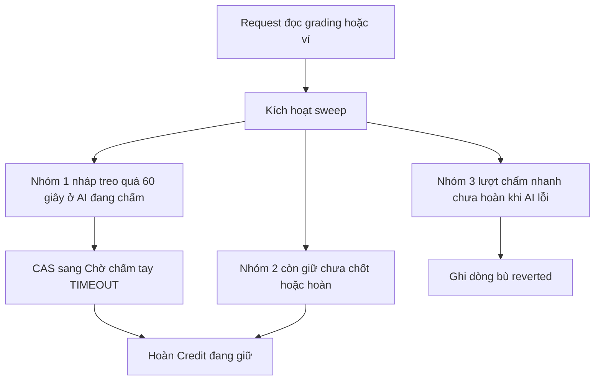
```mermaid
flowchart TD
    A["Request đọc grading hoặc ví"] --> B["Kích hoạt sweep"]
    B --> C["Nhóm 1 nháp treo quá 60 giây ở AI đang chấm"]
    C --> D["CAS sang Chờ chấm tay TIMEOUT"]
    D --> E["Hoàn Credit đang giữ"]
    B --> F["Nhóm 2 còn giữ chưa chốt hoặc hoàn"]
    F --> E
    B --> G["Nhóm 3 lượt chấm nhanh chưa hoàn khi AI lỗi"]
    G --> H["Ghi dòng bù reverted"]
```

Nguồn: apps/server/src/lib/ai-grading/release-stale.ts:41-173.

## F9 — Highlight nhận xét trên essay

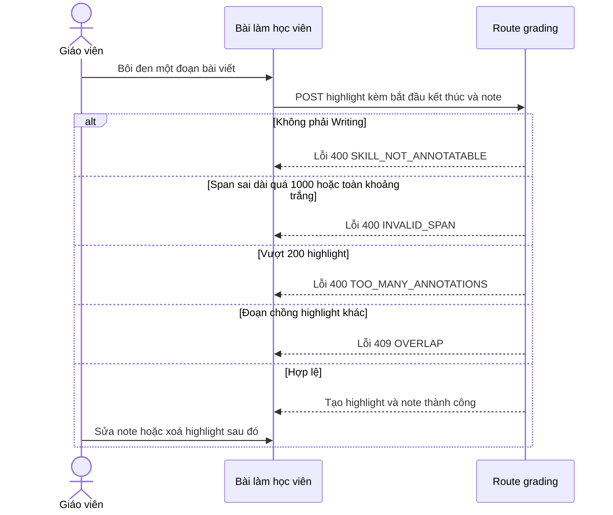
```mermaid
sequenceDiagram
    actor GV as Giáo viên
    participant UI as Bài làm học viên
    participant API as Route grading
    GV->>UI: Bôi đen một đoạn bài viết
    UI->>API: POST highlight kèm bắt đầu kết thúc và note
    alt Không phải Writing
        API-->>UI: Lỗi 400 SKILL_NOT_ANNOTATABLE
    else Span sai dài quá 1000 hoặc toàn khoảng trắng
        API-->>UI: Lỗi 400 INVALID_SPAN
    else Vượt 200 highlight
        API-->>UI: Lỗi 400 TOO_MANY_ANNOTATIONS
    else Đoạn chồng highlight khác
        API-->>UI: Lỗi 409 OVERLAP
    else Hợp lệ
        API-->>UI: Tạo highlight và note thành công
        GV->>UI: Sửa note hoặc xoá highlight sau đó
    end
```

Nguồn: apps/server/src/routes/grading.ts:1342-1468; packages/api/src/lib/essay-annotations.ts:21-62; packages/api/src/contracts.ts:2567-2569, 2580-2587.

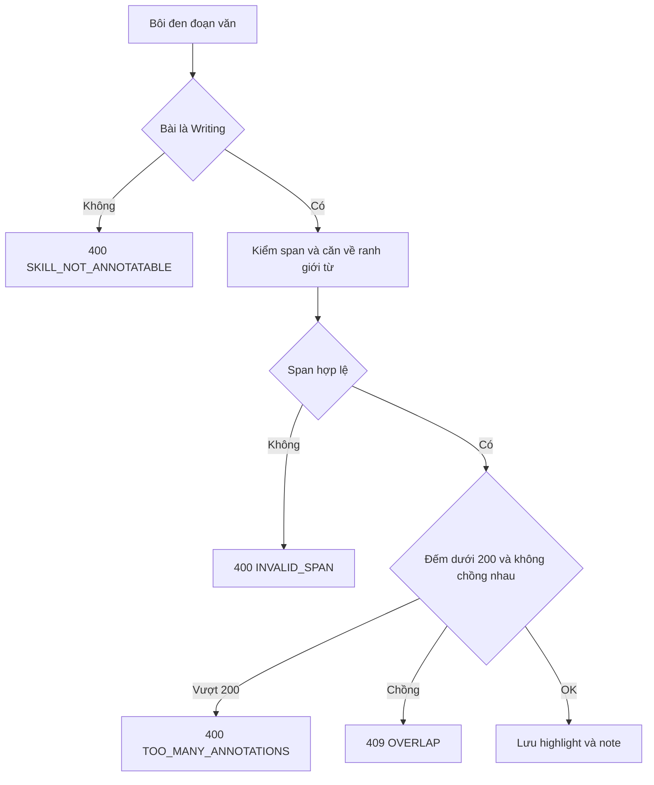
```mermaid
flowchart TD
    A["Bôi đen đoạn văn"] --> B{"Bài là Writing"}
    B -->|"Không"| C["400 SKILL_NOT_ANNOTATABLE"]
    B -->|"Có"| D["Kiểm span và căn về ranh giới từ"]
    D --> E{"Span hợp lệ"}
    E -->|"Không"| F["400 INVALID_SPAN"]
    E -->|"Có"| G{"Đếm dưới 200 và không chồng nhau"}
    G -->|"Vượt 200"| H["400 TOO_MANY_ANNOTATIONS"]
    G -->|"Chồng"| I["409 OVERLAP"]
    G -->|"OK"| J["Lưu highlight và note"]
```

Nguồn: apps/server/src/routes/grading.ts:1342-1407; packages/api/src/lib/essay-annotations.ts:21-62.

## F10 — Bài nộp mẫu demo

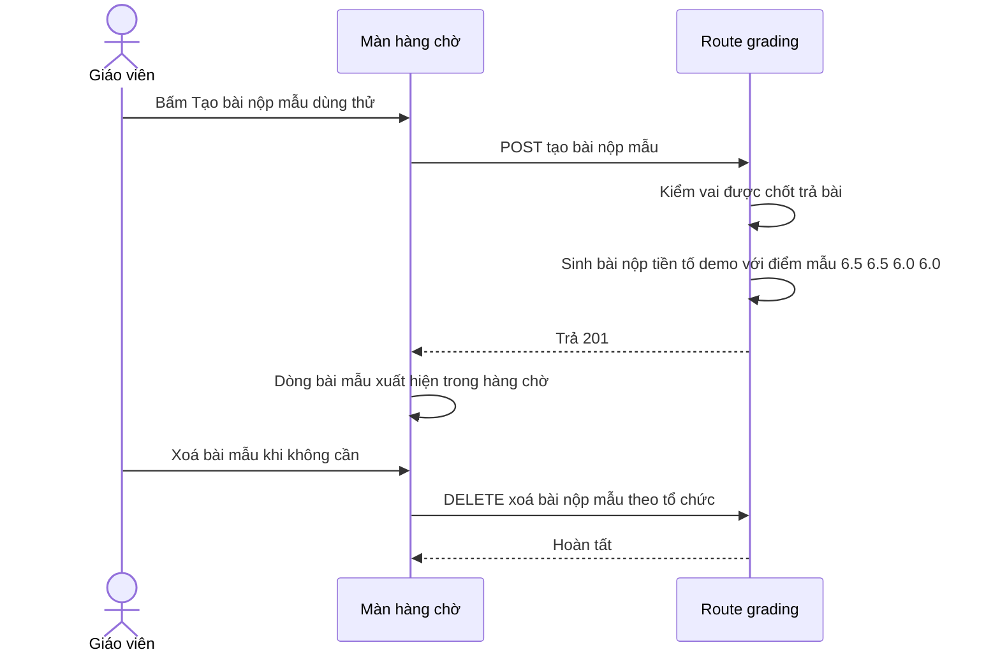
```mermaid
sequenceDiagram
    actor GV as Giáo viên
    participant UI as Màn hàng chờ
    participant API as Route grading
    GV->>UI: Bấm Tạo bài nộp mẫu dùng thử
    UI->>API: POST tạo bài nộp mẫu
    API->>API: Kiểm vai được chốt trả bài
    API->>API: Sinh bài nộp tiền tố demo với điểm mẫu 6.5 6.5 6.0 6.0
    API-->>UI: Trả 201
    UI->>UI: Dòng bài mẫu xuất hiện trong hàng chờ
    GV->>UI: Xoá bài mẫu khi không cần
    UI->>API: DELETE xoá bài nộp mẫu theo tổ chức
    API-->>UI: Hoàn tất
```

Nguồn: apps/server/src/routes/grading.ts:732-746 (điểm mẫu L741-746), :880 (201), :883-944 (DELETE); apps/web/src/routes/_auth/grading/index.tsx:335-379.

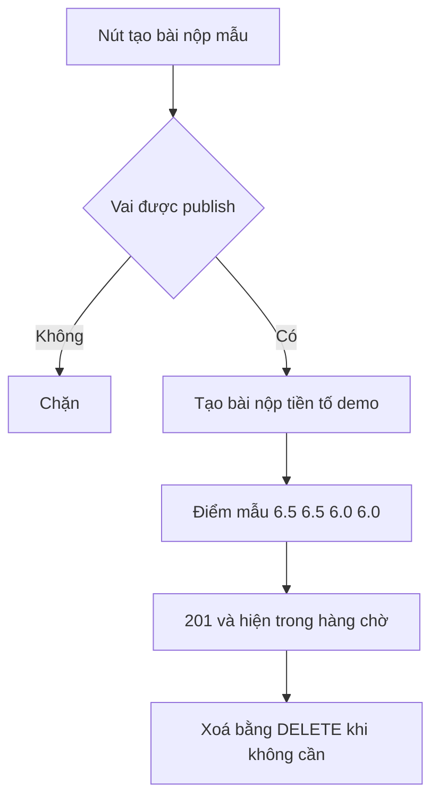
```mermaid
flowchart TD
    A["Nút tạo bài nộp mẫu"] --> B{"Vai được publish"}
    B -->|"Không"| C["Chặn"]
    B -->|"Có"| D["Tạo bài nộp tiền tố demo"]
    D --> E["Điểm mẫu 6.5 6.5 6.0 6.0"]
    E --> F["201 và hiện trong hàng chờ"]
    F --> G["Xoá bằng DELETE khi không cần"]
```

Nguồn: apps/server/src/routes/grading.ts:732-746, 883-944.

- Quy ước luồng khi bài mẫu demo đi qua publish: không gửi thông báo và không đụng ví (apps/server/src/routes/grading.ts:88, 1115-1130).
